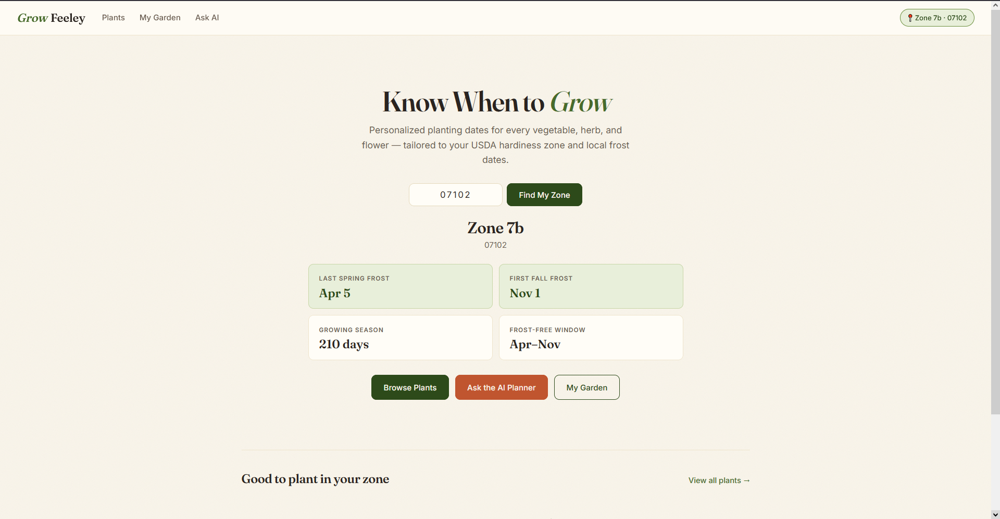
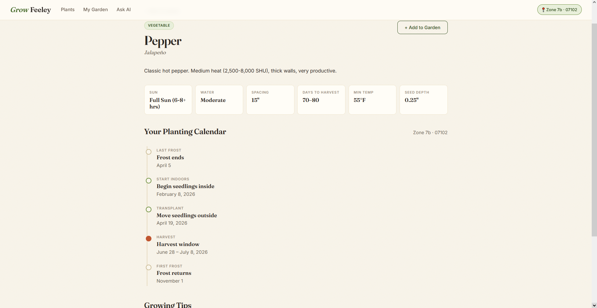
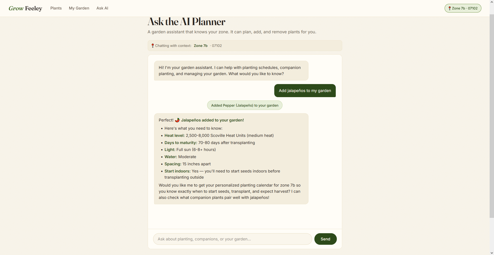
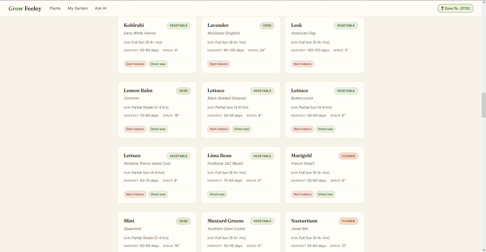
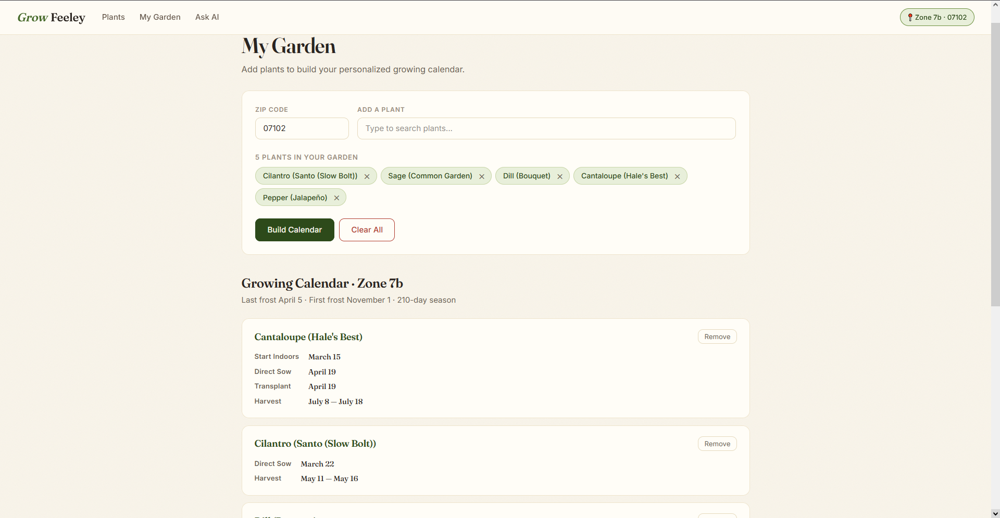
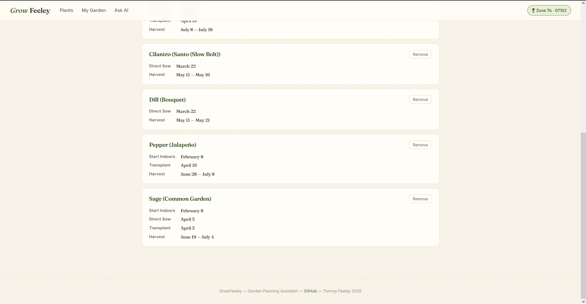

# GrowFeeley

**AI-powered garden planning assistant with personalized planting calendars based on USDA hardiness zones.**

**Live:** [growfeeley.pythonanywhere.com](https://growfeeley.pythonanywhere.com)

---




## What it does

Enter a zip code and GrowFeeley pulls your USDA hardiness zone from a public plant-hardiness API, looks up your region's average frost dates, and generates a personalized planting calendar for every plant in the database — including when to start seeds indoors, when to transplant, when to direct sow, and when to expect your harvest.

The site also includes an **AI garden assistant** (built on the Anthropic Claude API with tool-use) that can answer questions about planting schedules, companion planting, and can directly add or remove plants from your virtual garden through natural conversation.

## Key features

- **Zone-aware calendar generation.** Every plant's planting dates are computed from real frost data using offsets stored on each `Plant` model (e.g. "start indoors 6 weeks before last frost, transplant 2 weeks after"). No hardcoded dates.
- **AI assistant with tool use.** The chat interface uses the Anthropic API's tool-use feature to let Claude call structured functions — `add_plant_to_garden`, `remove_plant_from_garden`, `lookup_zone`, `get_plant_info`, `find_companions` — and return results that update the UI in real time.
- **Companion planting logic.** A separate `CompanionRelationship` model tracks which plants help or hurt each other, surfaced both on plant detail pages and as warnings when building a garden.
- **102+ plant library.** Sourced from Rutgers Cooperative Extension and other land-grant university extension services. Covers vegetables, fruits, herbs, and flowers — from common home-garden staples (tomato, basil, lettuce) to perennials (asparagus, rhubarb, blueberries).
- **Frost-aware warnings.** Flags plants whose harvest window extends past your first frost date, suggesting you start earlier or use frost protection.

## Tech stack

- **Backend:** Django 4.2, SQLite
- **Frontend:** Server-rendered Django templates, vanilla JavaScript, custom CSS (no framework). Fraunces + Inter typography.
- **AI:** Anthropic Claude API (tool-use / agent pattern)
- **External APIs:** [phzmapi.org](https://phzmapi.org) for zip-to-zone lookup
- **Deployment:** PythonAnywhere

## Architecture highlights

### The agent pattern

The AI chat isn't a glorified ChatGPT wrapper. The view at `garden/views.py::api_chat` implements a full tool-use loop:

1. Client sends messages + current garden state (plants, zip, zone) to `/api/chat/`
2. Server passes this to Claude with a tool definitions schema
3. Claude decides whether to respond directly or call a tool
4. If a tool is called, the server executes it (querying the DB, mutating state) and returns the result to Claude
5. Claude uses the result to form its response, which may trigger more tool calls
6. Final response + any garden state changes flow back to the client

This is the same pattern used in production AI agent systems.

### The calendar math




Each `Plant` stores its growing schedule as offsets relative to last frost — e.g. `weeks_start_indoors=6`, `weeks_transplant=2`, `weeks_direct_sow=1`. When a user enters a zip code:

1. `ZipToZone` maps the zip to a USDA zone (with fallback to the live phzmapi.org API for zips not in the local table)
2. `FrostDateByZone` provides average last/first frost dates for that zone
3. `Plant.get_calendar(frost_data)` computes the actual planting dates by applying the offsets

This lets the entire 102-plant library personalize automatically for every US hardiness zone without storing any per-zone, per-plant data.

## Screenshots

### AI garden assistant



### Plant library




### My Garden calendar builder






## Running locally

```bash
# Clone and enter the repo
git clone https://github.com/tommyfeeley/GrowFeeley.git
cd GrowFeeley

# Set up a virtualenv
python -m venv venv
# Windows:
venv\Scripts\activate
# Mac/Linux:
source venv/bin/activate

# Install dependencies
pip install -r requirements.txt

# Migrate the DB and load starter data
python manage.py migrate
python manage.py seed_data

# Set your Anthropic API key
# Windows (PowerShell):
$env:ANTHROPIC_API_KEY="sk-ant-..."
# Mac/Linux:
export ANTHROPIC_API_KEY="sk-ant-..."

# Run the server
python manage.py runserver
```

Visit `http://localhost:8000` and enter a zip code to get started.

## Data sources

- **Plant data:** Rutgers NJAES Cooperative Extension, UMass Extension, Cornell Home Gardening, Penn State Extension
- **Frost dates:** NOAA climate data, university extension services
- **Zip → hardiness zone:** [phzmapi.org](https://phzmapi.org)

## Roadmap

Things I might add if I keep building this:

- Perennial-aware calendar rendering (current `get_calendar` treats all plants as annuals)
- Multi-year planning for crops with year-over-year schedules (asparagus, garlic, rhubarb)
- Photo support for plants
- User accounts so gardens persist server-side instead of in localStorage
- Scheduled reminder emails ("Time to start your tomatoes indoors next week")

## About

Built by [Tommy Feeley](https://linkedin.com/in/tommy-feeley). Portfolio site: [tommyfeeley.github.io/resume](https://tommyfeeley.github.io/resume). GitHub: [@tommyfeeley](https://github.com/tommyfeeley).
